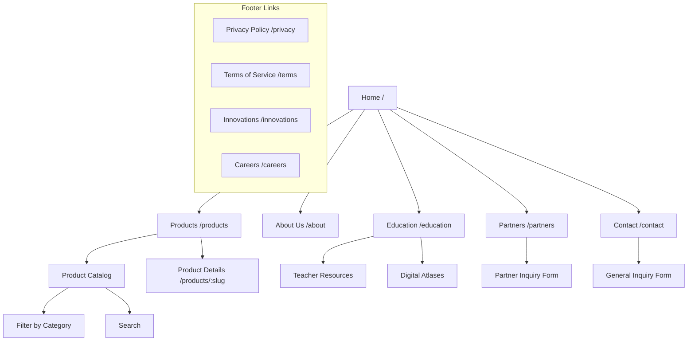

# Sitemap & Information Architecture

**Project:** IAT Digital Platform
**Date:** 2025-11-21
**Status:** Active

---

## 1. High-Level Structure

The website follows a hierarchical structure with a strong focus on product discovery and educational resources.

---

## 2. Detailed Sitemap

### 1.0 Home (`/`)
*   **Hero Section**: Value proposition, "About Us" CTA.
*   **Features Grid**: Key capabilities (Maps, Education, Mobile).
*   **Stats/Trust**: Social proof.
*   **Footer**: Navigation, Socials, Legal.

### 2.0 Products (`/products`)
*   **Catalog View**: Grid of all products.
*   **Filters**:
    *   All Products
    *   Atlases
    *   Maps
    *   Education
    *   Mobile Apps
*   **Product Details** (`/products/[slug]`):
    *   Hero Image/Preview
    *   Description & Features
    *   "Visit Store" (External Link) OR "Request Demo" (Internal Form)

### 3.0 About Us (`/about`)
*   **Mission & Vision**: Core values.
*   **Team**: Key personnel.
*   **History**: Timeline (Optional).

### 4.0 Education (`/education`)
*   **Overview**: Educational tools value prop.
*   **Resources**: Links to atlases and teacher guides.
*   **LMS Login**: (Future) Link to external LMS.

### 5.0 Partners (`/partners`)
*   **Benefits**: Why partner with IAT.
*   **Partner Form**: Specialized inquiry form.

### 6.0 Contact (`/contact`)
*   **Contact Info**: Address, Email, Phone.
*   **General Form**: Standard inquiry form.

### 7.0 Legal & Utility
*   **Privacy Policy** (`/privacy`)
*   **Terms of Service** (`/terms`)
*   **Innovations** (`/innovations`) - R&D showcase (Placeholder).
*   **Careers** (`/careers`) - Job listings (Placeholder).

---

## 3. User Flows

### A. Product Discovery & Purchase
1.  **Entry**: User lands on Home or Products page.
2.  **Browse**: User filters by "Atlas".
3.  **Select**: User clicks "Interactive Atlas of Ukraine".
4.  **Action**:
    *   *If External*: Clicks "Visit Store" -> Redirects to `osvitanet.com.ua`.
    *   *If Enterprise*: Clicks "Request Demo" -> Fills embedded form.

### B. Partnership Inquiry
1.  **Entry**: User clicks "Partners" in footer or nav.
2.  **Info**: Reads about benefits.
3.  **Action**: Fills "Partnership Inquiry" form.
4.  **Feedback**: Receives success message + Auto-reply email.

---

## 4. Navigation Structure

### Main Header
*   **Logo** (Home)
*   **Products**
*   **About Us**
*   **Education**
*   **Contact Us** (Button)
*   **Theme Toggle**
*   **Mobile Menu** (Hamburger)

### Footer
*   **Products**: Maps, Educational Tools.
*   **Company**: About Us, Careers, Partners, Innovations.
*   **Legal**: Privacy, Terms.
*   **Socials**: Facebook, LinkedIn.

---

## 5. Content Types (CMS)

To support this architecture, the CMS will need the following schemas:

*   **Product**: Title, Slug, Category, Description, Features, Image, External Link.
*   **TeamMember**: Name, Role, Bio, Photo.
*   **BlogPost** (Future): Title, Slug, Content, Date.
*   **Partner**: (Internal CRM data from forms).
